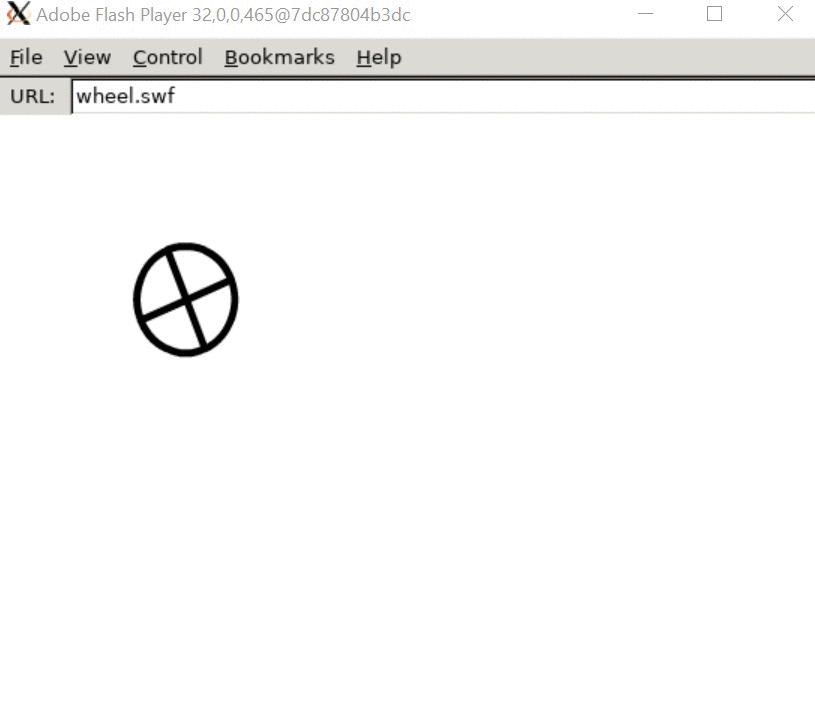

# Running flash player inside a Docker container

As most of you are aware Adobe Flash has reached [end of life](https://www.adobe.com/products/flashplayer/end-of-life.html) and is no longer enabled on major browsers. This makes me sad because I have fond memories of flash animations and games that were all over the web in my early days. There are already several initiatives to allow for these old files to continue running in modern era from a [standalone catalog and player with over 70,000 games](https://bluemaxima.org/flashpoint/) to a [full-fledged flash emulator written in Rust](https://github.com/ruffle-rs/ruffle).

Recently I did a [Docker](https://www.docker.com/) course and since I am a firm believer in learning by doing I wanted a very small project as a kind of exercise. So I decided to see if it is possible to wrap a flash player inside a docker container. This would be a good exercise but probably more fun than practical since a flash player can still be [installed on a machine](https://www.adobe.com/support/flashplayer/debug_downloads.html) even if it does not come by default in the browser. The only practical use would be to enable old flash animations or games inside the browser or other clients with minimal hustle for end users such as installing third party plugins or programs.

So the goal would be to run a flash animation from a swf file inside docker and stream the video to a remote client. In this blog post, I will document the process I went through and what I learned. Along the way I will do my best to explain the relevant docker concepts. Let's get started.

### Prerequisites

First things first, we will need to get docker. The easiest way to install docker on Windows is to [download and install docker desktop](https://hub.docker.com/editions/community/docker-ce-desktop-windows). This requires Hyper-V which unfortunately does not come with all Windows 10 distributions so make sure to check for that.  

Next, we will need some kind of video streaming client. There are two easy options [vnc](https://en.wikipedia.org/wiki/Virtual_Network_Computing) and [x11](https://en.wikipedia.org/wiki/X_Window_System). The latter seemed easier to set up on Windows. It is a single executable that can be installed with `choco install vcxsrv` . For a complete step by step guide please refer to [this tutorial](https://medium.com/@potatowagon/how-to-use-gui-apps-in-linux-docker-container-from-windows-host-485d3e1c64a3).

### Dockerfile

With all the prerequisites in place it is time to get to work on the Dockerfile. This is a special type of file that contains instructions for docker about how to prepare an *image* file. The image file is essentially an executable that contains the app that you are trying to run along with all dependencies it needs. Once we have an image it can be run inside a *container*.

To keep it simple I am going to use ubuntu 18 as a base image. This greatly simplifies the setup because ubuntu comes with a ton of preinstalled dependencies and a package manager that lets us easily install more packages as needed. 

In order to get the standalone flash running we need only a few things:

1. install any flash player library dependencies
2. download and unzip flash player
3. start flash player with a specific swf file that is either hosted or copied to the container
4. point flash player to output to the remote display

The resulting docker file is straightforward enough. My only issue was figuring out the list of dependencies. Unfortunately flash player did not provide this list (at least I was not able to find it). After some googling and failed attempts I ended up just trying to run the docker container and adding the missing libraries one by one as they were reported. Luckily there were only a few of these dependencies, but it was still a bit cumbersome.

```docker
FROM ubuntu:18.04
RUN apt-get update

# flash dependencies
RUN apt-get install -y libglu1 libxcursor1 libnss3 libgtk2.0-0

# download and extract flash player
WORKDIR /usr/local/flash
RUN apt-get install -y curl && curl -O https://fpdownload.macromedia.com/pub/flashplayer/updaters/32/flash_player_sa_linux.x86_64.tar.gz
RUN tar zxvf flash_player_sa_linux.x86_64.tar.gz

# copy over a sample swf file for a quick demo
COPY ./wheel.swf wheel.swf 

# start the flash player with the demo swf file
CMD /usr/local/flash/flashplayer wheel.swf
```

One minor note, it is not necessary to have the swf locally, the flash player will happily run a swf file from a URL, but for me this was easier to set up.

### Building and running the container

I used the standard build command to build an image from the above docker file:

`docker build -t flash .`

For those new to docker, this command is essentially saying to docker to build an *image* from the dockerfile above and give it a tag flash, which we can use later to refer to the image.

Next, the tricky part is connecting the GUI from docker to my local Windows machine. Luckily this is made easy with VcXsrv which we installed previously, as it does most of the heavy lifting. All we need to do is point the docker container to our VcXsrv instance using our host IP. The below command has my current host IP address, make sure to change that with your IP (use `ipconfig`)

`docker run --rm -e DISPLAY=192.168.178.108:0.0 flash`

This command tells docker to run the image tagged *flash* and point the display to the VcXsrv running on the host OS. The flag `--rm` is there to make sure that the container is removed as soon as we close the flash player dialog on the host OS so that the container does not take resource unnecessarily.

And the outcome is this nice flash animation, streamed from a linux docker container to my Windows machine. Hooray 🎉



### Wrap up

Before wrapping up, I want to point out two caveats that I learned about after completing this. The first one is that the flash animation has a picture, but no sound. This requires more setup and another application called PulseAudio. A sample dockerfile can be found [here](https://github.com/TheBiggerGuy/docker-pulseaudio-example). Another caveat is that supposedly the linux package of the flash player is less stable and more error-prone than the windows one. So if you are really considering using this for any kind of serious project I highly recommend switching to a Windows container. Unfortunately I only found out about this after I finished this exercise, so it makes little sense to go back right now and redo everything. Perhaps one day in the future. 

I hope this post helps you on your journey with Docker, it certainly was a lot of fun to implement it.

All sources are on GitHub: [https://github.com/gajduk/docker-flash](https://github.com/gajduk/docker-flash)